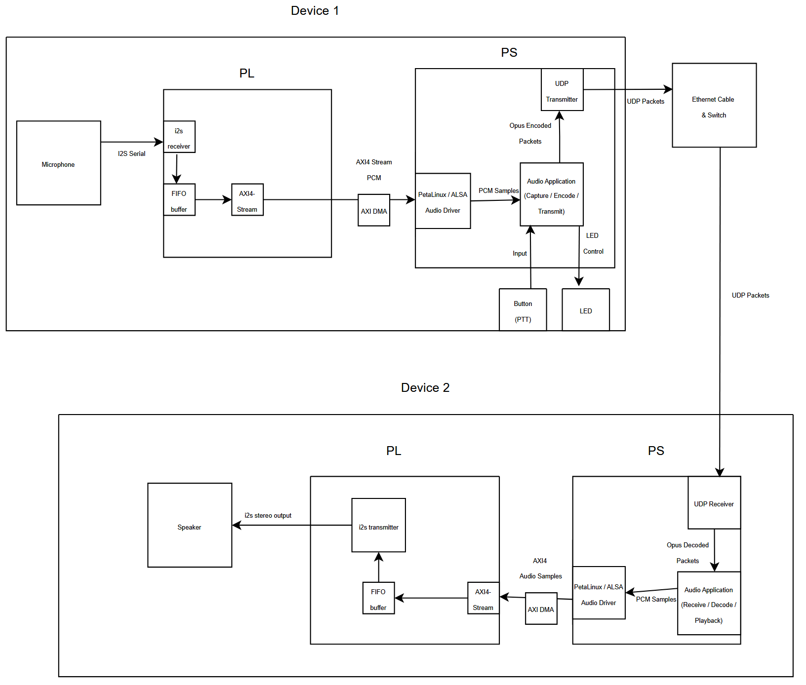
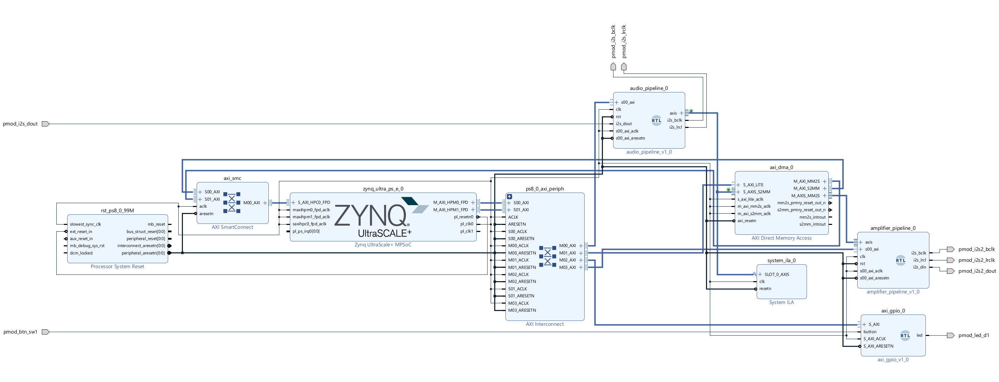

# KV260 Walkie Talkie
**Project:** Design Project A (COMP3601) - Custom FPGA Walkie-Talkie System

**Platform:** Xilinx Kria KV260 Vision AI Starter Kit

**Team Members:**

- Gilbert Tong
- Benjamin Lam
- Kaira Dumasia
- Shuruthy Dhushiyandan

**Term:** T3 2025

Make sure to look at the `REAL FILES` directory for the actual files!

---

## Table of contents
- [KV260 Walkie Talkie](#kv260-walkie-talkie)
  - [Table of contents](#table-of-contents)
  - [Project Overview](#project-overview)
  - [Data Flow](#data-flow)
  - [Hardware Implementation](#hardware-implementation)
  - [Software Implementation](#software-implementation)
    - [Modules](#modules)
    - [Project Structure/Layout](#project-structurelayout)
  - [Build Instructions](#build-instructions)
    - [Petalinux Implementation](#petalinux-implementation)
    - [Bare Metal Implementation](#bare-metal-implemenation)
  - [Testing](#testing)
  - [Troubleshooting](#troubleshooting)
    - [1. DMA not initialising](#1-dma-not-initialising)
    - [2. Missing Opus Library During Compilation](#2-missing-opus-library-during-compilation)
    - [3. Device Tree Configuration](#3-device-tree-configuration)
  - [Future implementation](#future-implementation)
  - [References](#references)
    - [Documentation](#documentation)
    - [Source Code](#source-code)
    - [Tools](#tools)
  - [Contributions](#contributions)


---
## Project Overview
This Project attempts to implement a complete embedded system featuring:
- **Real-time Audio Processing:** Low-latency DMA-based audio capture and playback.
- **Opus Compression:** Audio streaming, encoding/decoding and compression/decompression.
- **Network Communication:** UDP audio streaming with multicast.
- **Hardware Acceleration:** FPGA fabric for I2S audio interface.
- **PTT Control:** Push-to-talk button with LED feedback.
- **Embedded Linux:** PetaLinux-based OS with custom drivers and custom device tree overlay

## System Architecture Overview
The KV260 Walkie-Talkie system consists of:
- Programmable Logic (PL) implements real-time I2S audio capture/playback.
- Processing System (PS) runs either PetaLinux (multi-board) or Vitis bare-metal (single-board).
- AXI DMA provides high-bandwidth audio transfer between PL and DDR.
- Application layer handles Opus codec, networking, threads, and GPIO.

### System Flow Diagram


---

## Data Flow
**Transmit Path:** Board 1
1. **Capture:** ```I2S Mic → Audio Pipeline → AXI-Stream → DMA S2MM → DDR```
2. **Process:** ```Read from DDR → Convert 32→16 bit → Opus Encode```
3. **Transmit:** ```UDP packet (Multicast) → Ethernet → Network```

**Receive Path:** Board 2
1. **Receive:** ```Network → Ethernet → UDP packet```
2. **Process:** ```Opus Decode → Convert 16→32 bit → Write to DDR```
3. **Playback:** ```DDR → DMA MM2S → AXI-Stream → Audio Pipeline → I2S Speaker```

---
## Hardware Implementation

The **same Vivado hardware design** is used for both:
- the **PetaLinux** system, and  
- the **bare-metal (Vitis)** application.

All programmable-logic (PL) logic targets the **Xilinx Kria KV260** and lives in the Vivado project.

### Vivado Design Overview

The Vivado project (`project_with_amp/`) contains the block design and all custom VHDL used by the walkie-talkie:

```text
project_with_amp/
├── ibr_design.bd                # Block design (PS + AXI + custom audio IP + GPIO)
├── sources/
│   ├── ibr_design_wrapper.v     # Top-level wrapper for the KV260 design
│   ├── audio_pipeline.vhd       # I2S audio capture/playback pipeline
│   ├── amplifier_pipeline.vhd   # I2S pipeline driving the external amplifier
│   ├── ctrl_bus.vhd             # Simple control/status register interface
│   ├── i2s_master.vhd           # I2S master for main audio path
│   ├── i2s_master_amplifier.vhd # I2S master for amplifier path
│   ├── fifo.vhd                 # FIFO buffer for audio_pipeline
│   ├── fifo_amplifier.vhd       # FIFO buffer for amplifier_pipeline
│   └── axi_gpio.vhd             # AXI GPIO for PTT button and status LED
├── constraints/
│   └── kria-constraints.xdc     # KV260 pin, clock and I/O constraints
└── utils/
    └── ibr_design_wrapper.dcp   # Design checkpoint for regenerating bitstream
```
### Hardware Functionality

- **Audio Pipeline:**  
  Implements I²S capture/playback for the microphone and speaker.  
  Converts between I²S serial data and AXI-Stream for the DMA engine.

- **Amplifier Pipeline:**  
  Dedicated I²S transmitter feeding the external audio amplifier.

- **FIFO Buffers:**  
  Used for clock-domain crossing between the I²S clock and AXI clock.

- **AXI GPIO:**  
  Connects the Push-To-Talk (PTT) button and status LED to the Zynq MPSoC.

### Exported Hardware (XSA)

The Vivado design is exported as `project_with_amp_design_wrapper.xsa` file located in:
project_with_amp/

### Vivado Block Diagram


---

## Software Implementation

```
walkietalkie/        (Main application)
├── opus_helper/     (Audio compression/decompression and decode/encode)
├── network/         (UDP networking: send/receive voice data)
├── audio_dma/       (DMA control and memory buffer management)
└── gpio_ptt/        (PTT button handling & LED status indication)
```

### Modules
1. Main Application ```walkietalkie.c```
    - Coordinates all files and manages the threads
    - Key Functions
        - ```main()```: Entry point and initialisation
        - ```tx_thread_func()```: Transmit audio
        - ```rx_thread_func()```: Receive audio loop

2. Opus Helper ```opus_helper.c```
    - Wrapper for the libopus codec
    - Key Functions:
        - ```opus_init()```: Initialise the encoder and decoder
        - ```opus_encode_frame()```: Compress and encode audio
        - ```opus_decode_frame()```: Decompress amd decode to PCM

3. Network ```network.c```
    - Multicast UDP socket communication
    - Key Functions:
        - ```network_init()```: Create socket and configure
        - ```network_send()```: Transmit Opus packet
        - ```network_recv()```: Receive Opus packet

4. Audio DMA ```audio_dma.c```
    - Hardware DMA control
    - Key Functions:
        - ```dma_init()```: Initialises the registers and buffers
        - ```dma_capture_frame()```: S2MM audio capture
        - ```dma_playback_frame()```: MM2S audio output

5. GPIO PTT ```gpio_ptt.c```
    - GPIO interface control
    - Key Functions:
        - ```gpio_init()```: Export and configure pins
        - ```gpio_read_ptt()```: Read button
        - ```gpio_set_tx_led()```: Control LED indicator

### Project Structure/Layout

```
walkie_talkie_project/
├── project-spec/
│   ├── meta-user/
│   │   ├── recipes-apps/
│   │   │   └── walkietalkie/
│   │   │       ├── files/
│   │   │       │   ├── walkietalkie.c
│   │   │       │   ├── opus_helper.c
│   │   │       │   ├── opus_helper.h
│   │   │       │   ├── network.c
│   │   │       │   ├── network.h
│   │   │       │   ├── audio_dma.c
│   │   │       │   ├── audio_dma.h
│   │   │       │   ├── gpio_ptt.c
│   │   │       │   ├── gpio_ptt.h
│   │   │       │   └── Makefile
│   │   │       └── walkietalkie.bb
│   │   ├── recipes-bsp/
│   │   │   └── device-tree/
│   │   │       └── files/
│   │   │           └── system-user.dtsi
│   │   ├── recipes-kernel/
│   │   │   └── linux/
│   │   │       └── linux-xlnx/
│   │   │           └── kernel-config.cfg
│   │   └── conf/
│   │       └── layer.conf
│   └── configs/
│       └── rootfs_config
├── images/
│   └── linux/
│       ├── BOOT.BIN
│       ├── image.ub
│       └── rootfs.tar.gz
├── components/
│   └── plnx_workspace/
└── hardware/
    └── design_1_wrapper.xsa
```

## Build Instructions

### Petalinux Implementation

**Prerequisites**
 - Vivado with XCST: 2024.1
 - Petalinux: 2024.1
 - Ubuntu: 22.04 (Jammy Jellyfish)

 - 60 GB for PetaLinux tools
 - 30 GB for project build
---
**Create Petalinux Project**


```bash
# Source all of your settings
source /tools/Xilinx/Vivado/2024.1/ settings.sh
source /tools/Xilinx/PetaLinux/2024.1/settings.sh

# Create the project
petalinux-create -t project --template zynqMP -n walklie

# Add the custom hardware to the project
petalinux-config --get-hw-description="path/to/xsa file"
```
---
**Configure the Kernel**

```bash
petalinux-config -c kernel
```
Once in the kernel settings

```bash
- Device Drivers --->
    [*] Userspace I/O drivers --->
        <M> Userspace I/O platform driver with generic IRQ handling
    [*] DMA Engine support --->
        <*> Xilinx AXI DMA Engine

    - Networking support --->
        Networking options --->
            [*] IP: multicasting

```
**Add the application files**
```bash
petalinux-create -t apps --name walkietalkie --enable
```
---
**Copy source files**
```bash
cd project-spec/meta-user/recipes-apps/walkietalkie/files/
```

Copy all .c, .h, and Makefile here

---

**Edit recipe**
```bash
cd ..
nano walkietalkie.bb
```
- Copy the given bb file 
---
**Configure the Root Filesystem**

Enable the root to use the walkie talkie and Opus packages

```bash
petalinux-config -c rootfs
user packages --->
    [*] libopus
    [*] libopus-dev
    [*] walkietalkie
```
---
**Finally, build the system**

```bash
# Clean the build
petalinux-build -x mrproper

# Build everything
petalinux-build

# Package boot files
- petalinux-package --boot \
    --fsbl images/linux/zynqmp_fsbl.elf \
    --u-boot images/linux/u-boot.elf \
    --pmufw images/linux/pmufw.elf \
    --fpga images/linux/system.bit \
    --force 

# Create the SD card image
petalinux-package --wic

# Identify the SD (please do not write to your main partition it will delete everything)
lsblk

# Write the image (replace the /dev/sdX with your SD card)
sudo dd if=images/linux/petalinux-sdimage.wic \
        of=/dev/sdX \
        bs=4M \
        status=progress \
        conv=fsync

# Eject the SD card

sudo eject /dev/sdX
```
---
**First boot setup**

When booting the SD card add:

```bash
setenv bootargs "earlycon console=ttyPS0,115200 clk_ignore_unused root=/dev/mmcblk1p2 rw rootwait"
- saveenv
- boot
```
inside of the U-boot console so it initialises the partition correctly.

Login:
```bash
login: petalinux
password: petalinux
```
---
**Configure network (Board 1)**

```bash
- ip addr add 192.168.1.10/24 dev eth0
- ip link set eth0 up
- ip route add default via 192.168.1.1
```
---
**Configure network (Board 2)**
```bash
- ip addr add 192.168.1.11/24 dev eth0
- ip link set eth0 up
- ip route add default via 192.168.1.1
```
---
**Now to run the application!**

```bash
# Board 1:
./walkietalkie 192.168.1.11
# Board 2:
./walkietalkie 192.168.1.10
```
---

### Bare Metal Implemenation
*An alternative build:* this tests and shows the functionality of our custom walkie-talkie on one FPGA.

**Prerequisites**
- Vitis Classic
- Vivado with XCST: 2024.1

**Setup**

Download both the Vivado and Vitis porjects and store them in the same parent directory.

**Vitis Project**

Build the project by clicking on the hammer or right click and build project.
The main functionality is in the `project_final_system/src/helloworld.c`
- The volume of the speaker can change by changing the gain in this code
- The nummber of recordings stored at one time can also be changed here

**On the FPGA** 

This is an instant audio input and playback walkie-talkie like product with additional features. 
If you have an SD card, insert it into the SD card slot for your latest 5 audio files to be saved. 
This design can hold and store up to 5 different audio input files at once (modular design that can be changed), playback the most recent audio and switch between the latest 5 audio input files.

*Modes*
1. Long press: Hold the button (SW 1) for more than 5 seconds. The recording starts instantly and once the button is pressed for 5 seconds or longer the audio input gets saved. 
2. Short press: Press the button (< 1 second). This plays the latest audio file. 
3. Medium press: Press the button (> 1.5 seconds and < 3 seconds). This changes the current audio file to the audio file recorded before (if possible).

LED 1 acts as a status light.

## Testing

| Num | Category | Description | Pass Criteria |
|---|---|---|---|
| 1 | Hardware | GPIO control | LED and Button response |
| 2 | Hardware | DMA initialisation | No erroes and buffers mapped |
| 3 | Audio | Capture test | Audio samples coming in with signals |
| 4 | Audio | Playback test | Speaker is audible |
| 5 | Network | Connectivity | Ping success |
| 6 | Codec | Opus encode | Output size is roughly 60 bytes |
| 7 | Codec | Opus decode | No distortion and clear sound |
| 8 | Integration | End to end | Voice communication is good |
| 9 | Performance | Latency | < 100ms |

All of these tests have been implemented within the design and should print whenever \
an error occurs within the code. Otherwise, a passing signal should print.

---

## Troubleshooting

### 1. DMA not initialising

**Symptoms:** Program hangs after "Initialising DMA"

**Diagnosis:**

```bash
# Check if the DMA exists
cat /proc/iomem | grep dma
```
**Solution**
1. Try to reload the XSA file into the petalinux project
2. Rebuild and repackage the project and boot again

---

### 2. Missing Opus Library During Compilation

**Symptoms:** Build errors about missing Opus headers or undefined references

**Diagnosis:**
```bash
# Check if Opus is installed
ls /usr/lib/libopus*

# Check for headers
ls /usr/include/opus/
```

**Solution**
1. Try to recompile the rootfs
```bash
petalinux-config -c rootfs

# Navigate to:
user packages --->
    libs --->
        [*] libopus 
        [*] libopus-dev 
```

### 3. Device Tree Configuration

**Potential Issue:** Reserved memory for DMA buffers

**Solution:**
Ensure device tree has:
```dts
reserved-memory {
    audio_dma: audio_dma@70000000 {
        compatible = "shared-dma-pool";
        reg = <0x0 0x70000000 0x0 0x02000000>;
        no-map;
    };
};

&axi_dma_0 {
    memory-region = <&audio_dma>;
};
```

## Future implementation
**Audio Enhancements**

- Noise suppression.
    - RNNoise software.
- Voice Changer.
    - Create a custom application using Advanced Linux Sound Architecture (ALSA).

**Security**

- Stronger encryption for audio data.
    - Using OpenSSL to implement strong algorithms for encrypting data.
- Multiple channels to send data to a particular board.
- Authentication between boards.
    - Transport Layer Security (TLS) using OpenSSL to make multiple channels and authentication.

**User Interface and Experience**

- Display for status and user identification.
- Volume input and output control.
- Mute input audio.
    - ALSA to control audio mixer elements and mute

**Miscellaneous Features**

- Recording capability.
- Playback of recorded messages.
    - ALSA Utilities to record and manage audio playback
- Text messages and storage for those messages.
    - Partition the SD card for storing and retrieving messages using SQLite
---

## References

### Documentation
- [Xilinx UG1144: PetaLinux Tools Documentation](https://docs.amd.com/r/en-US/ug1144-petalinux-tools-reference-guide)
- [Kria KV260 Vision AI Starter Kit User Guide](http://docs.amd.com/r/en-US/ug1089-kv260-starter-kit)
- [AXI DMA Product Guide (PG021)](https://docs.amd.com/r/en-US/pg021_axi_dma/Navigating-Content-by-Design-Process)
- [Opus Codec RFC 6716](https://www.rfc-editor.org/rfc/rfc6716)

### Source Code
- [Opus Library](https://opus-codec.org/)
- [Github Source Code](https://github.com/spytrooper007/KV260-Walkie-Talkie)

### Tools
- [Vivado and Vitis](https://www.amd.com/en/products/software/adaptive-socs-and-fpgas/vivado.html)
- [PetaLinux](https://www.amd.com/en/products/software/adaptive-socs-and-fpgas/embedded-software/petalinux-sdk.html)

## Contributions

| Member | Role | Contributions |
|---|---|---|
| Gilbert | Software Development | Petalinux incorporation, DMA drivers, Opus integration, Software documentation |
| Ben | Network Implementation | Multicast UDP communication, Software Testing, Bare-metal network integration |
| Kaira | Hardware | Microphone and speaker Vivado Design block, Vitis bare-metal dseign and testing |
| Shuruthy | Hardware | I2S IP, GPIO and amplifier Vivado Design block, XSA file testing, Complete design block integration |
